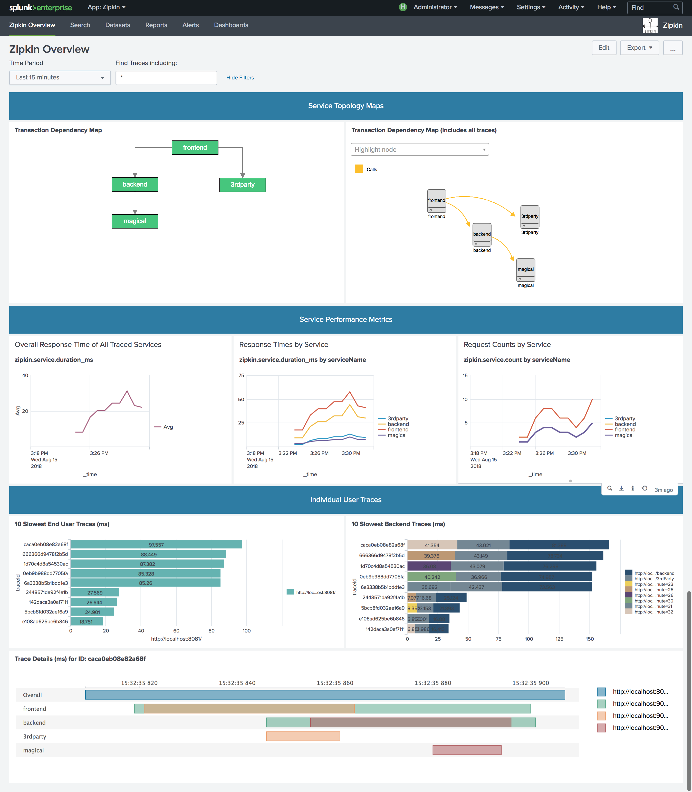

# Basic example showing distributed tracing from a web browser across node.js apps
This application was forked from the original source at https://github.com/openzipkin/zipkin-js-example and then modified to send traces to Splunk.  Additionally, this repo contains Splunk apps and visualizations to help visualize and monitor the performance of services and traces.

The demo application includes a static web page and three node.js express services that are invoked to service the ttp request. Each component of the application is traced using Zipkin and all spans are recorded in Splunk. This allows you to see the how long the whole operation took, as well how much time was spent in each service.

Here's an example of what it looks like


# Implementation Overview

Web requests are served by [Express](http://expressjs.com/) controllers, and tracing is automatically performed by [zipkin-js](https://github.com/openzipkin/zipkin-js). JavaScript used in the web browser is bundled with [browserify](http://browserify.org/).

# Running the example
This example has four services: frontend, thirdparty, backend and magical. Each service reports Zipkin trace data to Splunk. To setup the demo, you need to start the application (npm start) and Splunk Enterprise. You'll also need to bundle the JavaScript used by the web browser.

Once the services are started, and the JavaScript is bundled, `open index.html`
* This starts a trace in the browser and calls the frontend (http://localhost:8081/)
* This continues the trace and calls the backend (http://localhost:9000/backend) and thridparty (http://localhost:9001/3rdParty). The backend service will make a call to the magical service (http://localhost:9002/magical) passing in a date value.  The magical service returns a message that is then returned to the end user's browser. 

You will want to add the splunk_apps_for_zipkin to your Splunk instance in the /opt/splunk/etc/apps folder and restart Splunk.

Next, you can view traces that went through the backend via http://<splunk_server>/en-US/app/zipkin/zipkin_overview

## Setup

Before you start anything, you'll need to install the required node modules used in this demo:
```bash
$ npm install
```
Next, set 2 environment variables to point to your Splunk instance.  These are used in the [recorder.js](./sample_app/recorder.js) file.
```
export RECORDER_URL=http://localhost:8088/services/collector/raw
export RECORDER_AUTH='Splunk XXXXXXXX-XXXX-XXXX-XXXX-XXXXXXXXXXXX'
```
Note:  This project includes shell scripts with examples for both Zipkin backend as well as Splunk as the backend.  See teh run_app_xxx.sh files for more details.


Once that's done, bundle the JavaScript used by the browser:
```bash
$ npm run browserify
```

## Start the Services
Run `npm start`.  This will start all 4 services:  
1. [frontend.js](./sample_app/frontend.js)
2. [backend.js](./sample_app/backend.js)
3. [thirdparty.js](./sample_app/thirdparty.js)
4. [magical.js](./sample_app/magical.js)

```bash
$ npm start
```
## Execute the service
Open a web browser and hit http://localhost:8081/ a few times
Open another web browser and view the traces in Splunk: http://localhost:8000/en-US/app/zipkin/zipkin_overview

